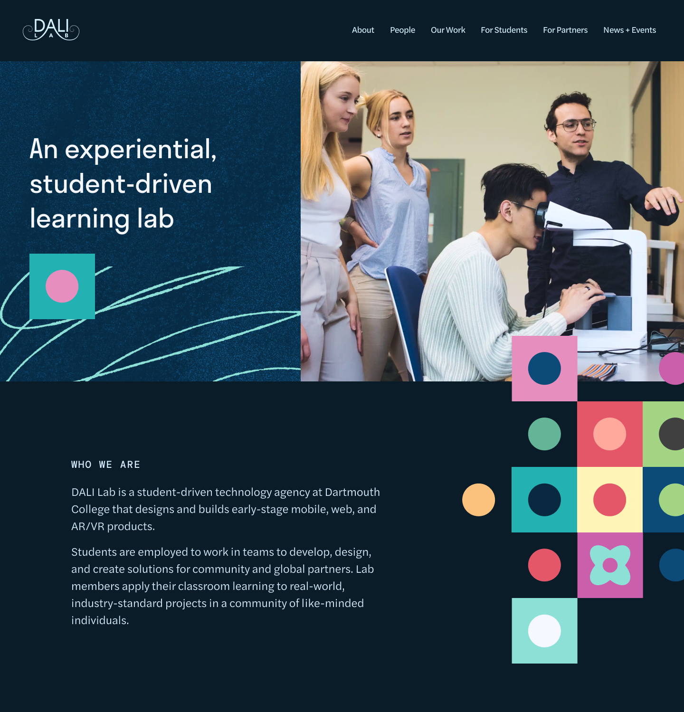
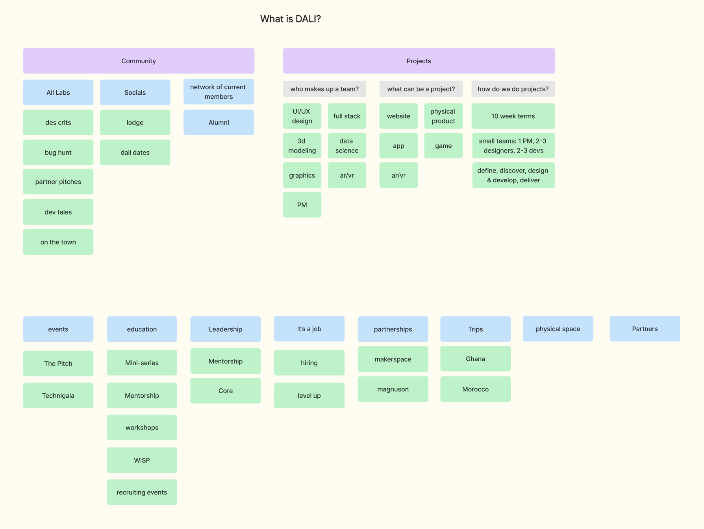
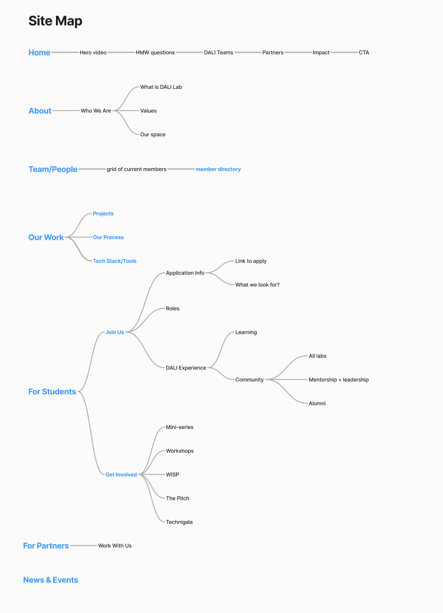
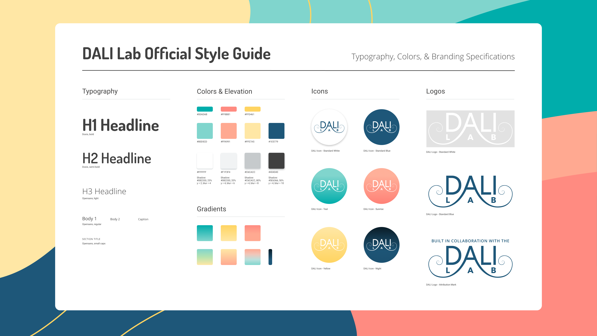
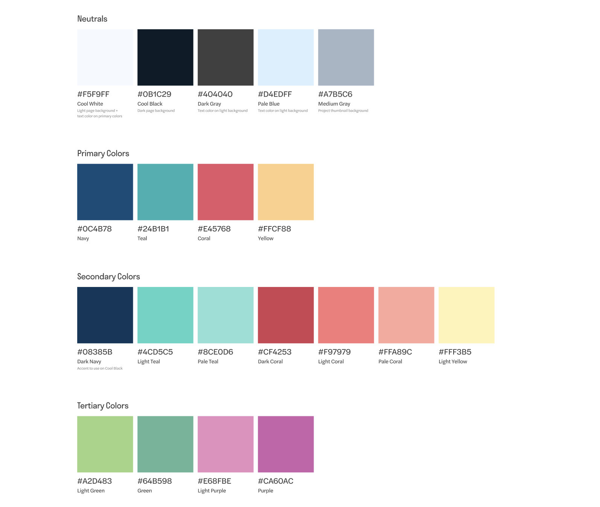
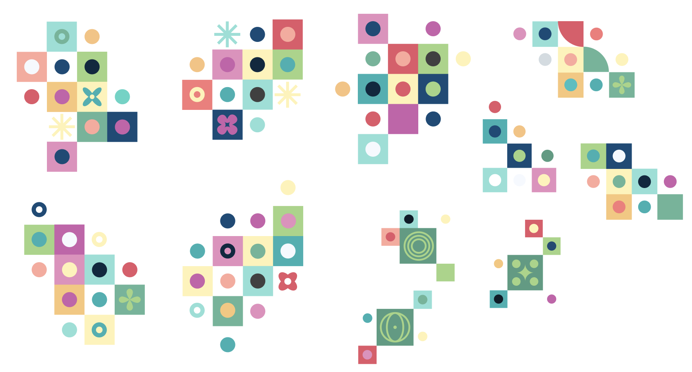
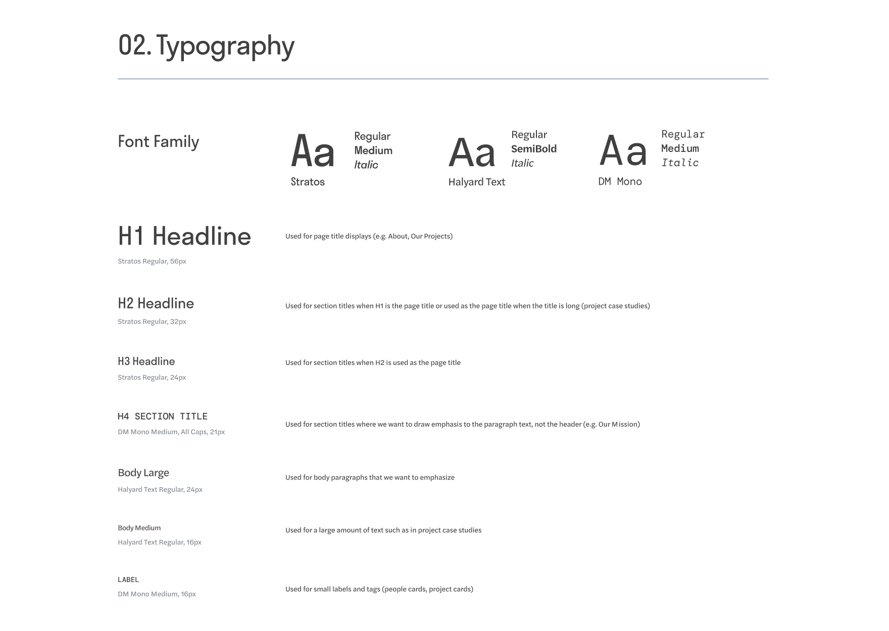
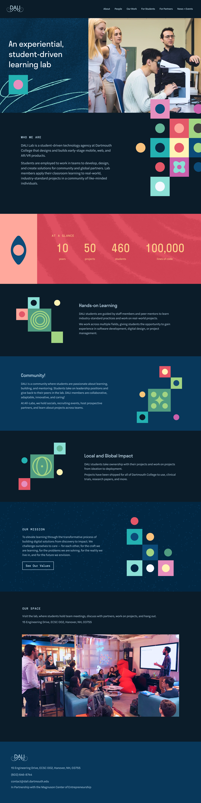
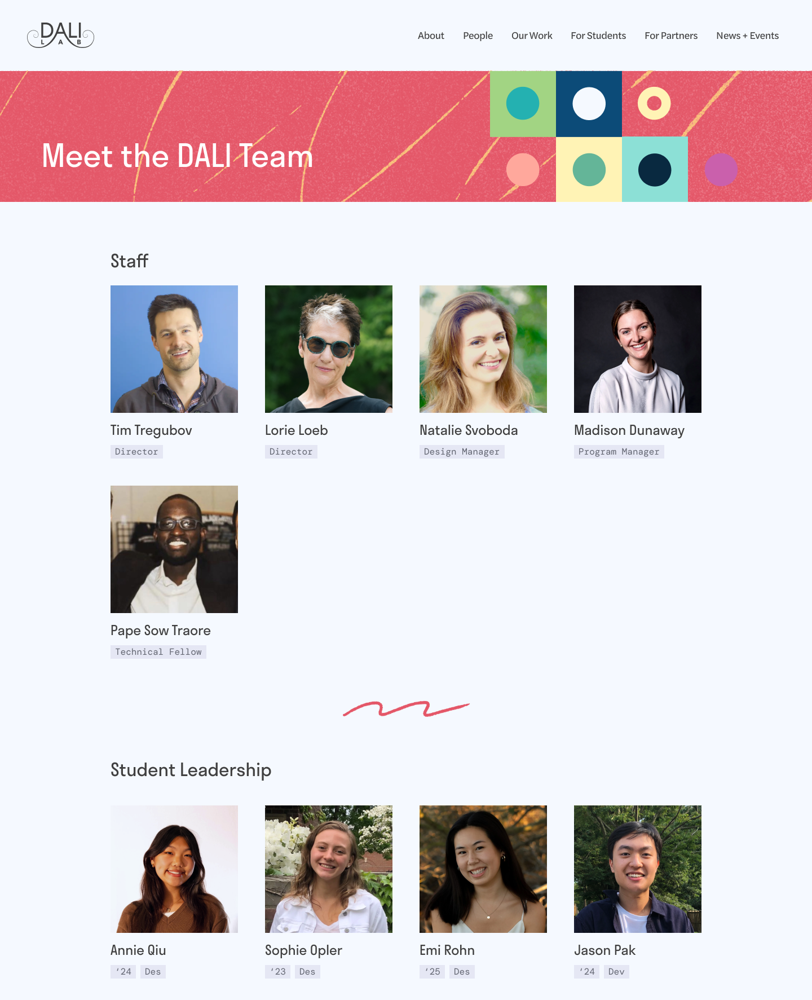
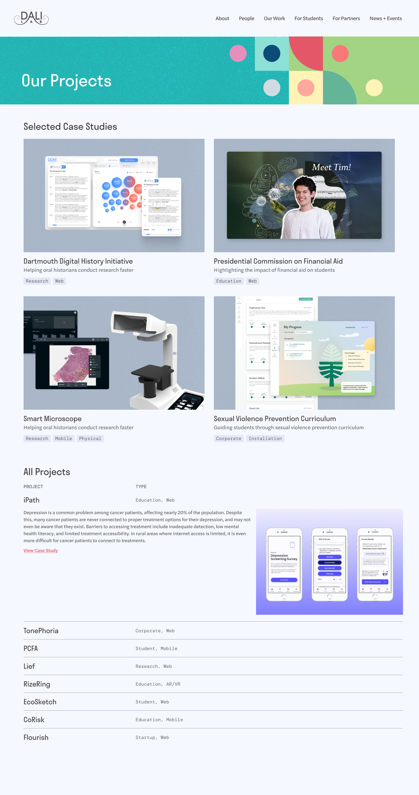

### Background

Digital Applied Learning & Innovation (DALI) Lab is a space at Dartmouth I was greatly involved and invested in. My senior spring, I led a proposed re-design of DALI's website.

The lab is a student-driven technology agencythat designs and builds early-stage mobile, web, and AR/VR products. Students are employed to work in teams to develop, design, and create solutions for a range of partners, including start-ups, research labs, and non-profits. At DALI, I have been a designer, developer, mentor, and a part of the lab's student leadership. 

### Current Website
DALI's <a class="link" href="https://dali.dartmouth.edu/">current website</a> is effective in introducing the lab and communicating the lab's student-driven, creative energy. However, it could be improved by **updating the visual style and highlighting less visible aspects of DALI** such as community events and mentorship.

### User Research
I interviewed DALI Lab members to determine what the key aspects of the lab experience are to inform the redesign's visual style.

I found that most members' insights on the lab could be organized into two categories: **experiential learning** and **community**:

Experiential Learning
<li>working with real-world partners on real-world projects</li>
<li>getting responsibility and ownership over work and space</li>
<li>receiving help with technical skills and career prospects</li>

Community
<li>access to mentorship and leadership opportunities</li>
<li>a physical space to gather and hang out in</li>
<li>meeting friends that are both like-minded and come from different parts of campus</li>

DALI Lab members are described as *self-starters, supportive, flexible, collaborative, caring*

DALI's physical space is described as *fun, cozy, funky, collaborative*

### Site Map

I documented all of DALI's offerings, including events like The Pitch, educational programs, and the alumni network. I used this categorization to propose a new site map.

### Updated Style

**DALI's Current Style Guide**

I drew from DALI's current style guide to inform the updated brand style. The current brand style has primary colors of **teal, coral, and yellow**, which felt key to DALI's identity and has been featured in many existing DALI graphics. 

### Colors

I kept the primary teal, yellow, and coral colors but expanded the colors with complimentary greens, purples, and a bigger range of lighter and darker primary colors.

### Graphics

I worked with graphics designer Julia Lee to design a system of graphics that could be used throughout the website. The graphics draw from the expanded color system and follow an orderly grid structure of squares and circles, but the shapes vary in color and arrangement, reflecting DALI's technical yet creative core.

### Typography

I updated DALI's main typefaces to be more modern while maintaining the original typefaces' personalities. Dosis is replaced with Stratos, which is similarly narrow and tall but features sharp edges instead of rounded corners. The sans serif body font is updated with Halyard Text, and I introduced a monoface font to use for labels and minor headings.

### Hifis

I applied the redesigned style guide and added illustrated textures to four hi-fi pages. 

### About

### Team

### Projects
A grid of featured projects with an expandable table layout below for all other projects

