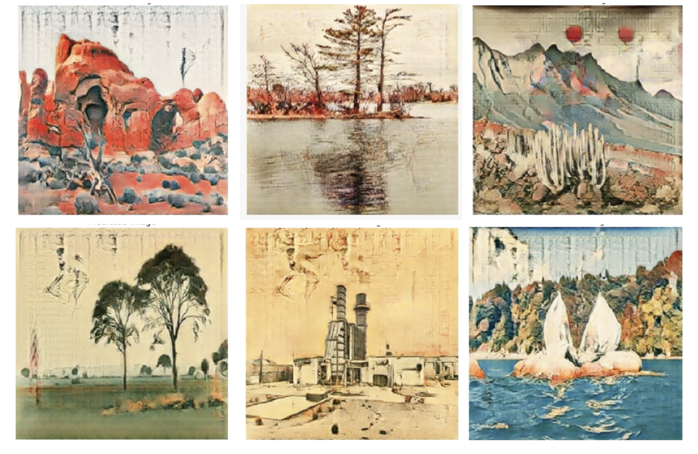
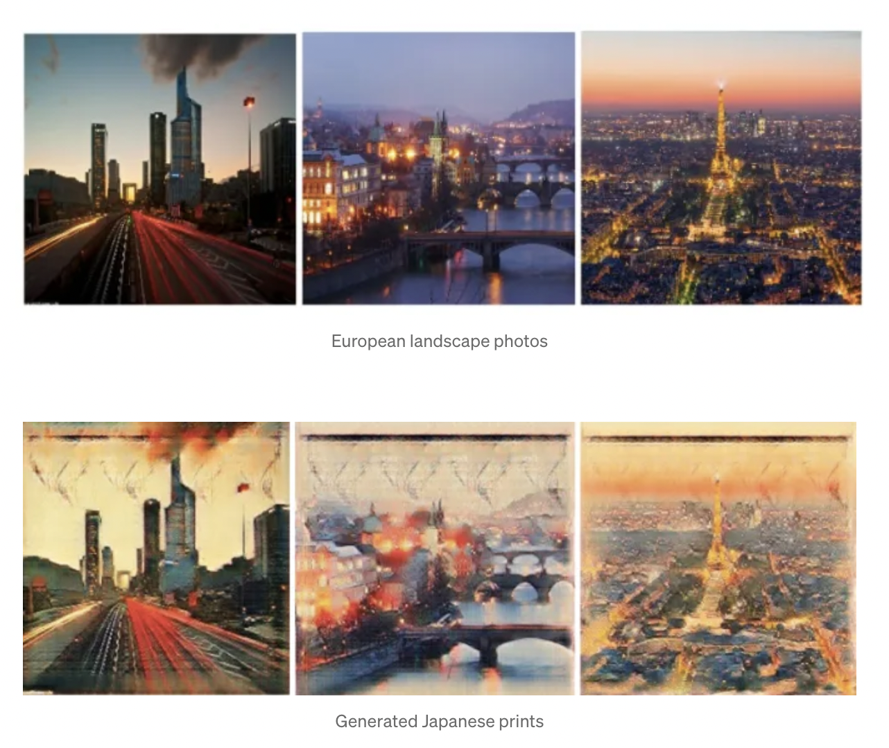

We used CycleGAN to create a neural network model that transfers the style of Ukiyo-e Japanese prints to photos of nature and cityscapes.

<a href="https://medium.com/@winnzerrs/style-transfer-of-japanese-prints-with-cyclegan-2f3fee4bd264" class="link">Medium Article ↗</a>

