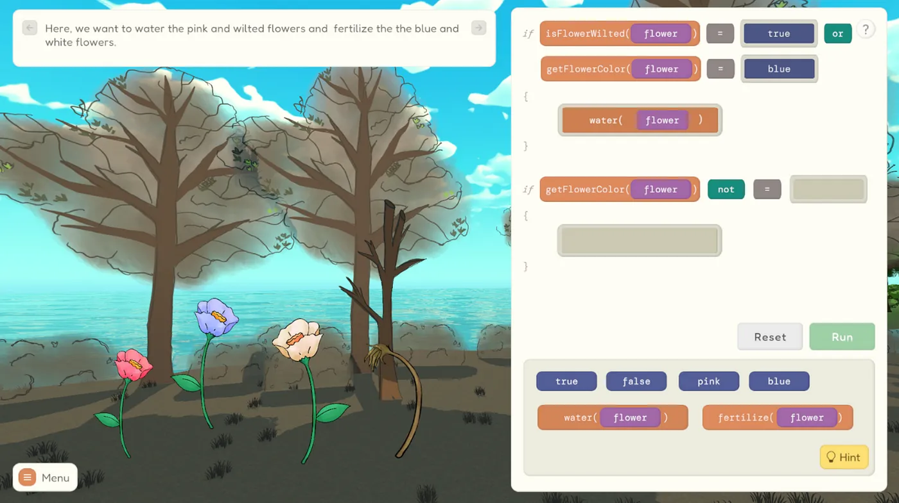
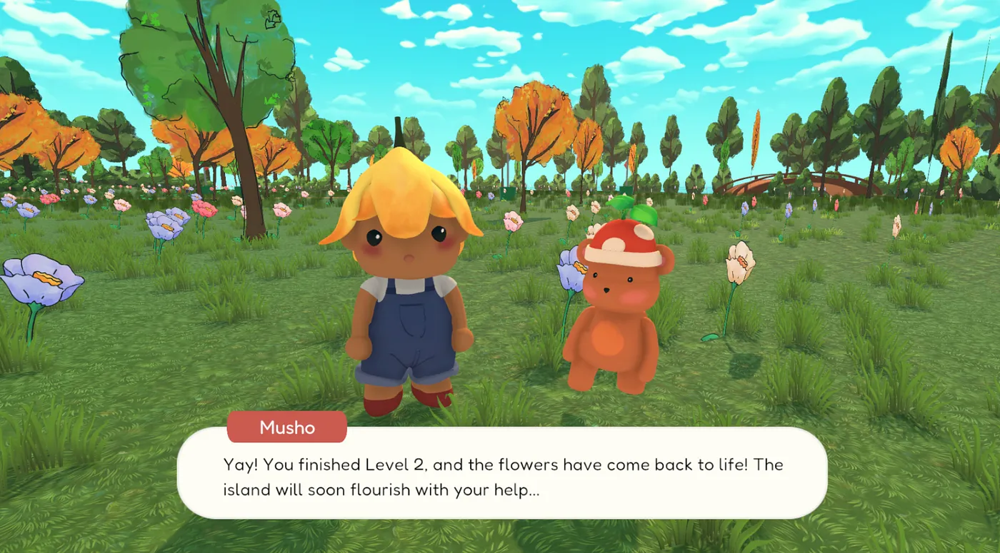

### Background
The learning curve to study coding can seem daunting and complex. LeafyLearn aims to break barriers in coding education by teaching programming to anyone and everyone in a fun, interactive, approachable, and aesthetic game.

As a part of the CS Major Culminating Experience, we created a game that could help lower the barriers to learning how to code by making the process approachable and fun. We aimed to reach people of all backgrounds and teach concepts in a way that is digestible and affordable. 

Features
<li>drag-and-drop, interactive UI panel to learn programming concepts</li>
<li>three concept zones: functions, if-statements, while-loops</li>
<li>island environment that comes back to life after levels are completed</li>
<li>3D characters and 2D environment</li>

### My Role
UI/UX designer, 3D modeler, and front-end developer

### Learn More

<li><a class="link" href="https://leafylearn.site">Website ↗</a>
</li>
<li><a class="link" href="https://medium.com/dartmouth-cs98/leafylearn-breaking-barriers-in-programming-education-c6537d5d7845">Medium Article ↗</a></li>

