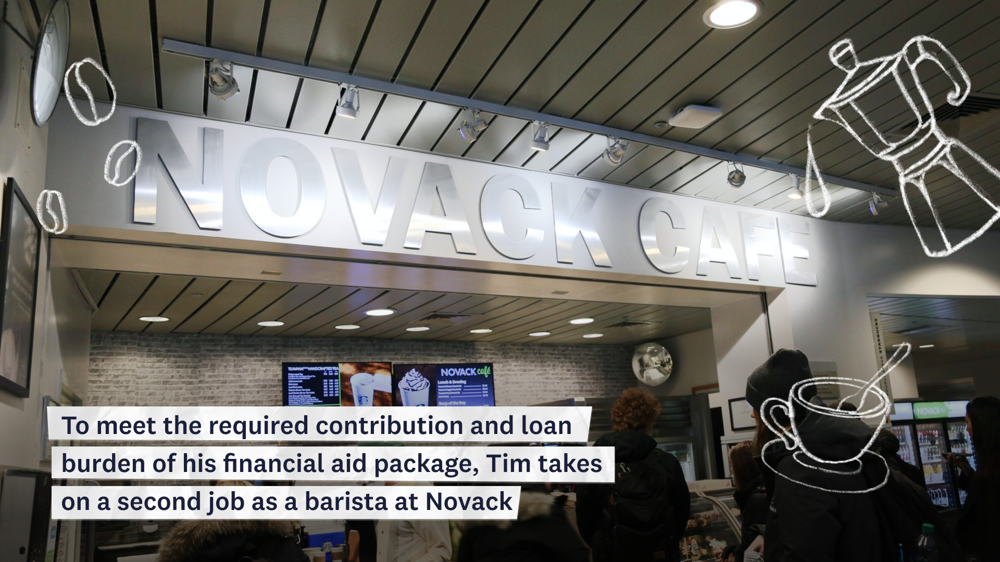

### Background

The Presidential Commission on Financial Aid (PCFA) is a committee at Dartmouth that aims to increase funding for Dartmouth's need-blind financial aid program. PCFA collaborated with DALI Lab to build an interactive website that would illustrates how financial aid can impact a student’s life to encourage Dartmouth alumni to donart towards financial aid. 

### My Role

I made sketches and storyboards for the website based on user research from pevious designers and designed hi-fi frames and illustrations.

<a class="link" href="https://shapethefuture.dartmouth.edu/">Try it out ↗</a>

