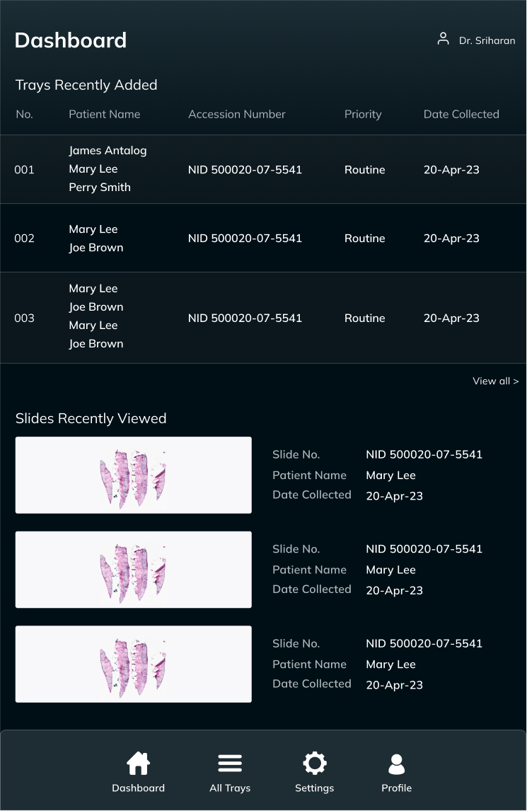
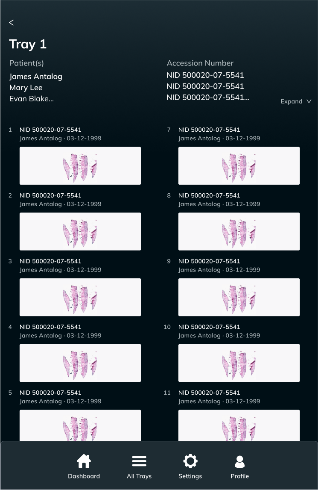

### Background

RavaOne: The SmartScope is a new smart microscope that allows clinicians to diagnose disorders from digital images with a physical microscope interface. 

> "A trained pathologist who would take just a few seconds to make a routine diagnosis using a traditional microscope would likely spend several minutes scrolling through high-resolution images on a monitor if they were using a computer alone."

### My Role
I worked in a team of many DALI Lab project managers, developers, and product engineers to design a prototype of the SmartScope. I updated the UI/UX design of the app paired with the physical microscope that clinicians use to navigate the digital cells they are examining.

### Learn More

<li><a class="link" href="https://home.dartmouth.edu/news/2023/05/geisel-professor-gives-microscopes-digital-makeover">Dartmouth: "Geisel Professor Gives Microscopes a Digital Makeover" ↗</a></li>
<li>Awarded Honorable Mention in <a class="link" href="https://www.nibib.nih.gov/training-careers/undergraduate-graduate/debut/2023-debut-challenge-winners">NIH’s 2023 VentureWell DEBUT Competition</a></li>

