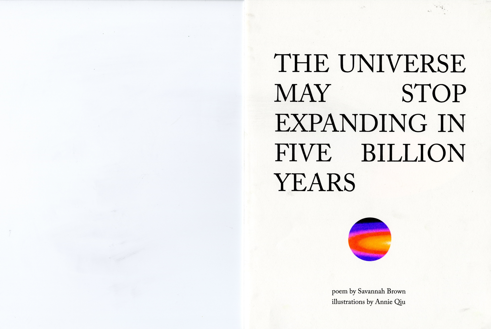

A risograph zine I illustrated and designed based off Savannah Brown's poem <a class="link" href="https://www.poetryfoundation.org/video/154521/savannah-brown-reads-the-universe-may-stop-expanding-in-five-billion-years">The Universe May Stop Expanding in Five Billion Years</a>, printed with the help of Wylie Kasai.

