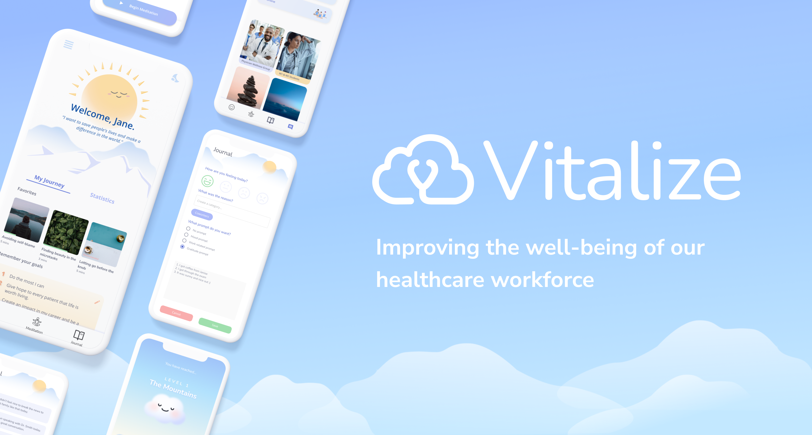
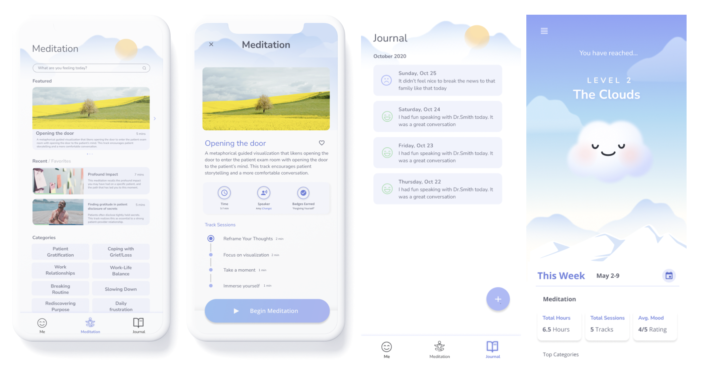

### Background
<a href="https://vitalizecare.co/" class="link">Vitalize</a> is the first mobile wellness app tailored for healthcare providers. Healthcare providers often face burnout and deal with the unique challenges that come with working in the healthcare industry. Vitalize provides mental health resources for healthcare professionals and is a YC-backed startup. 

### My Role
I worked as a UI/UX designer in Vitalize's early stage. I designed hi-fi frames, iterated on wireframes, and designed branding graphics.

