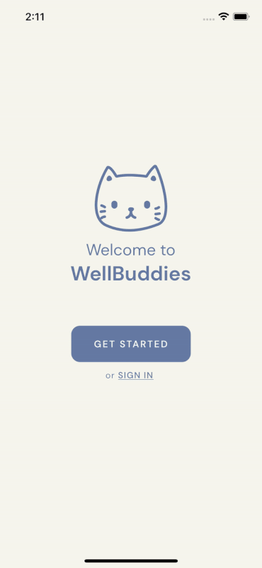
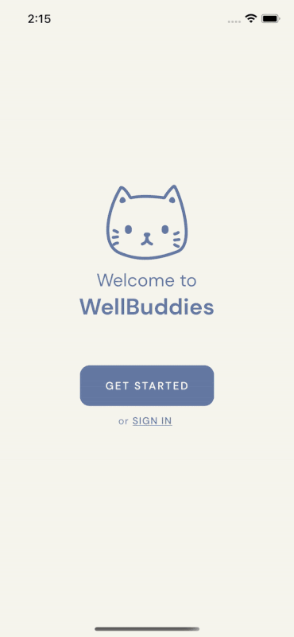
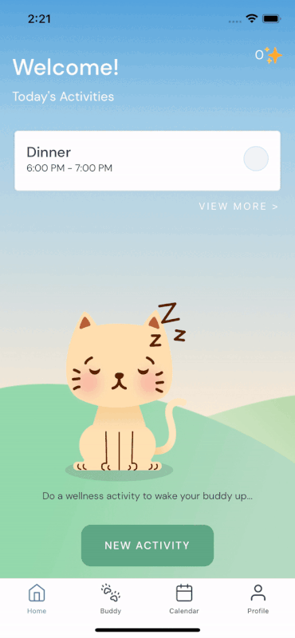
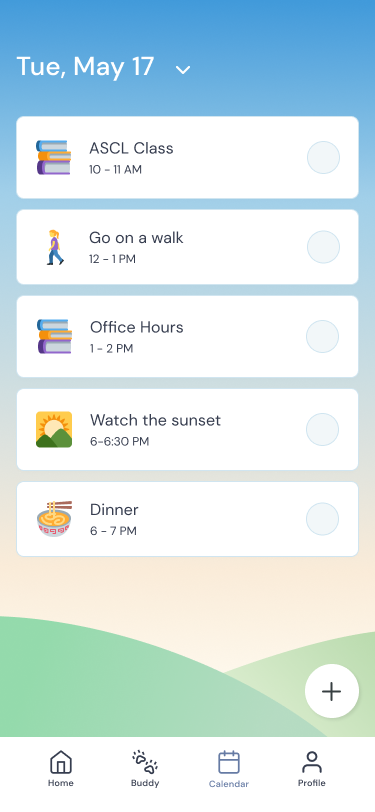

### Background

Wellbuddies was created for students to prioritize their own wellbeing despite busy schedules. 

The app gives users a digital pet and integrates with your Google Calendar to schedule in wellness activities that fit with your schedule. When you complete a wellness activity, your buddy’s mood improves so that when you take care of your buddy, you also take care of yourself.

Wellbuddies was first created for HackDartmouth VII as a small web app and won 2nd place in the Health and Recovery track. We then turned the website into a full-stack mobile app in a team of six.

### My Role

I designed the app's UI, integrated Google authentication, and used the Google Calendar API to get the user’s calendar events and available times. On the back-end, I worked on providing the app with suggested wellness activities based on the user’s availabilities.

### Final Product

**Onboarding:** Pick a buddy

**Sign In:** Sign in with Google and check in with your mood

**New Activity:** Wellbuddies automatically creates a new wellness event for you in your calendar. When you complete it, your buddy is taken care of with a treat

**Calendar:** Your in-app calendar is synced with your Google Calendar
